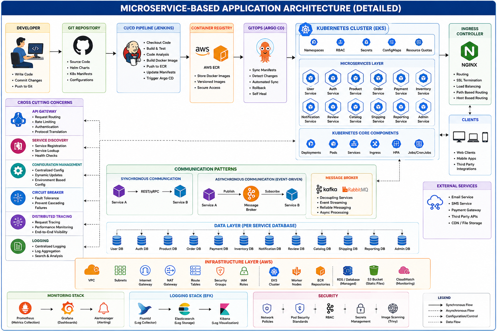

# 🛒 Kubernetes E-Commerce Microservices DevOps Project
<p align="center">
  
</p>
## 📌 Project Overview

This project is a complete Cloud Native E-Commerce Microservices Application built using modern DevOps tools and Kubernetes ecosystem technologies.

The application is divided into multiple independent frontend and backend microservices such as:

- Appliances
- Auto
- Beauty
- Books
- Computers
- Electronics
- Fashion
- Food
- Furniture
- Grocery
- Mobiles
- Sports
- Toys
- Two-Wheelers

Each module is independently manageable, scalable, and deployable using Kubernetes.

---

# 🏗️ Project Architecture

```text
Developer
   ↓
GitHub Repository
   ↓
GitHub Actions CI/CD Pipeline
   ↓
Docker Image Build
   ↓
AWS Elastic Container Registry (ECR)
   ↓
Argo CD GitOps Sync
   ↓
Kubernetes Cluster (AWS EKS)
   ↓
NGINX Ingress Controller
   ↓
Frontend & Backend Microservices
   ↓
AWS RDS Database
```

---

# 📂 Project Structure

```text
project-root/
│
├── .github/
│   └── workflows/
│
├── backend/
│
├── frontend/
│   ├── appliances/
│   ├── auto/
│   ├── beauty/
│   ├── books/
│   ├── computers/
│   ├── electronics/
│   ├── fashion/
│   ├── food/
│   ├── furniture/
│   ├── grocery/
│   ├── mobiles/
│   ├── sports/
│   ├── toys/
│   └── two-wheelers/
│
├── k8s-argocd/
│
├── eks-terraform/
│
├── grafana-prometheus/
│
├── efk-stack/
│
└── README.md
```

---

# 🚀 Technologies Used

| Technology | Purpose |
|---|---|
| Docker | Containerization |
| Kubernetes | Container Orchestration |
| AWS EKS | Managed Kubernetes Cluster |
| AWS ECR | Docker Image Registry |
| GitHub Actions | CI/CD Automation |
| Argo CD | GitOps Continuous Deployment |
| NGINX Ingress | External Traffic Routing |
| AWS RDS | Managed Relational Database |
| Terraform | Infrastructure Provisioning |
| Prometheus | Monitoring |
| Grafana | Visualization Dashboard |
| EFK Stack | Centralized Logging |

---

# 🔥 Key Features

- Complete Microservices Architecture
- Independent Frontend Services
- Kubernetes Orchestration
- Automated CI/CD Pipeline
- GitOps Deployment Strategy
- Infrastructure as Code using Terraform
- Monitoring and Logging Stack
- High Availability Design
- Scalable Deployment
- Production-Ready Architecture

---

# ⚙️ Microservices Explanation

The frontend is divided into category-based services.

## Example Frontend Services

- appliances
- electronics
- fashion
- food
- mobiles
- sports

Each service can:

- Run independently
- Scale independently
- Deploy independently
- Fail independently without affecting other services

## Benefits

- Better scalability
- Faster deployments
- Easier maintenance
- Fault isolation
- Faster development lifecycle

---

# 🐳 Docker Usage

Docker is used to package applications and dependencies into lightweight containers.

## Benefits of Docker

- Consistent environments
- Easy deployments
- Portability
- Faster builds
- Better resource utilization

Each microservice has its own Docker image.

---

# ☸️ Kubernetes Usage

Kubernetes manages:

- Container orchestration
- Scaling
- Networking
- Load balancing
- Self-healing
- Rolling updates

## Kubernetes Components Used

- Pods
- Deployments
- Services
- Ingress
- ConfigMaps
- Secrets
- Horizontal Pod Autoscaler
- Namespaces

---

# 🔄 CI/CD Workflow

## GitHub Actions

GitHub Actions automates:

- Application Build
- Docker Image Creation
- Docker Push to AWS ECR
- Kubernetes Manifest Updates

## Workflow Process

```text
Code Push
   ↓
GitHub Actions Trigger
   ↓
Docker Build
   ↓
Push Image to ECR
   ↓
Update Kubernetes YAML
   ↓
Argo CD Sync
   ↓
Deploy to Kubernetes
```

---

# 🚀 GitOps Deployment using Argo CD

Argo CD continuously monitors Git repositories.

When manifest changes occur:

- Argo CD detects updates
- Automatically syncs Kubernetes cluster
- Deploys latest version

## Benefits

- Automated deployment
- Easy rollback
- Git-based tracking
- Cluster synchronization
- Declarative infrastructure management

---

# 🌐 Ingress Controller

Ingress Controller exposes services externally.

## Responsibilities

- Domain routing
- HTTP/HTTPS traffic management
- Reverse proxy
- Load balancing

## Example Routes

```text
/electronics
/fashion
/mobiles
/books
```

All routes are managed using a single Ingress resource.

---

# 🗄️ AWS RDS Integration

AWS RDS is used as the managed relational database service.

## Stores

- User data
- Product details
- Orders
- Payment information

## Advantages

- Automated backups
- High availability
- Security
- Scalability
- Managed maintenance

---

# 📊 Monitoring Stack

## Prometheus

Used for:

- Metrics collection
- Kubernetes monitoring
- Resource usage monitoring
- Application monitoring

## Grafana

Used for:

- Dashboards
- Visualization
- Performance monitoring
- Alerting

---

# 📜 Logging Stack

## EFK Stack

### Components

- Elasticsearch
- Fluentd
- Kibana

## Purpose

- Centralized logging
- Log analysis
- Troubleshooting
- Monitoring application logs
- Kubernetes log aggregation

---

# 🛡️ Security Best Practices

- Kubernetes Secrets
- IAM Roles
- Secure Image Storage
- Namespace Isolation
- RBAC Authorization
- HTTPS Ingress
- Secure Database Connectivity
- Least Privilege Access
- Container Isolation

---

# 📈 Scalability Features

- Horizontal Pod Scaling
- Independent Service Scaling
- Load Balancing
- High Availability
- Distributed Architecture
- Rolling Updates
- Auto Healing

---

# 🎯 Real-Time Use Cases

| Industry | Usage |
|---|---|
| E-Commerce | Product Services |
| Banking | Secure Services |
| OTT Platforms | Streaming Applications |
| Healthcare | Patient Systems |
| Food Delivery | Order Services |

---

# 🧠 DevOps Concepts Covered

- CI/CD
- GitOps
- Infrastructure as Code
- Containerization
- Kubernetes Orchestration
- Monitoring
- Logging
- Cloud Native Deployment
- Microservices Architecture
- DevSecOps Basics

---

# 🎓 Interview Explanation

## ✅ Explain Your Project in Interview

I worked on a Kubernetes-based E-Commerce Microservices DevOps project where the application was divided into multiple independent frontend and backend services.

We used Docker for containerization and Kubernetes for orchestration and scaling.

GitHub Actions was used to automate CI/CD pipelines for building Docker images and pushing them into AWS ECR.

Argo CD was implemented for GitOps-based continuous deployment into Kubernetes clusters.

Ingress Controller handled external routing and AWS RDS was used as the managed relational database.

We also implemented monitoring using Prometheus and Grafana along with centralized logging using the EFK stack.

Infrastructure provisioning was managed using Terraform.

---

# ✅ Advantages of This Architecture

- Independent deployments
- Faster scaling
- Better fault tolerance
- Easy rollback strategy
- Cloud-native architecture
- Production-ready deployment
- High availability
- Centralized monitoring & logging
- Easy maintainability

---

# 📚 Learning Outcomes

Through this project, the following DevOps and Cloud concepts were implemented practically:

- Docker Containerization
- Kubernetes Administration
- GitOps Workflow
- CI/CD Automation
- AWS Cloud Services
- Terraform Infrastructure Provisioning
- Monitoring & Logging
- Production Deployment Strategies
- Microservices Architecture
- DevOps Best Practices

---
