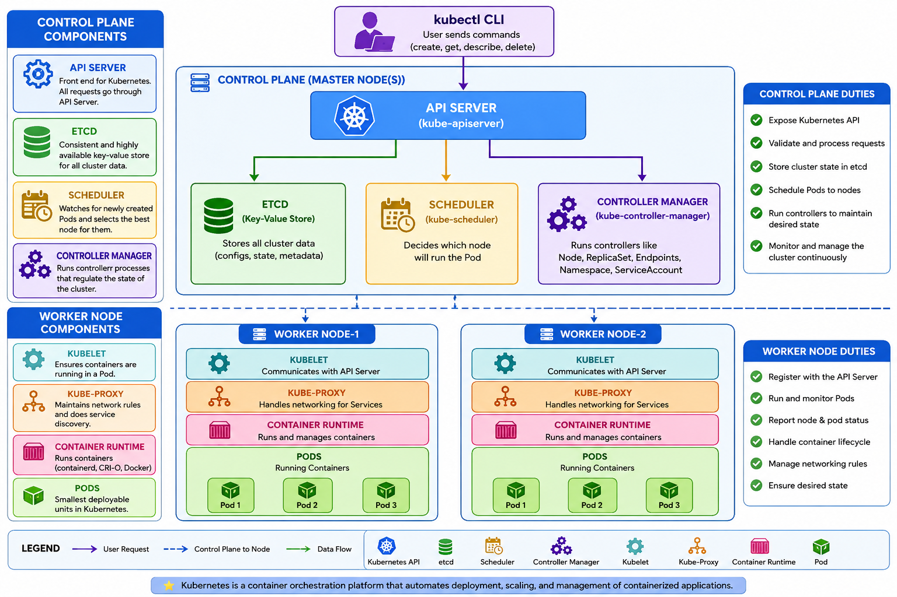

<div align="center">

# ☸️ Kubernetes Master Repository ☸️


### 🚀 Complete Kubernetes Learning Repository  
### 📘 From Beginner to Advanced  
### ⚡ Real-Time DevOps & Cloud Native Concepts  


---

</div>

# 📌 Repository Overview

This repository contains:

- Kubernetes Core Concepts
- Architecture Diagrams
- YAML Manifests
- Networking
- Scheduling
- Security
- Monitoring
- Logging
- Helm
- GitOps
- EKS
- Ingress
- CI/CD
- Real-Time Production Use Cases

---

# 🏗️ Kubernetes Architecture


---

# 📂 Repository Structure

```bash
kubernetes/
│
├── 01-architecture/
├── 02-pods/
├── 04-replicaset/
├── 05-vpc-cni/
├── 05-deployments/
├── 06-services/
├── 07-ingress/
├── 08-configmaps/
├── 09-secrets/
├── 10-volumes/
├── 11-statefulsets/
├── 12-daemonsets/
├── 13-HPA/
├── 14-taints-tolerations/
├── 15-node-affinity/
├── 16-networking/
├── 17-rbac/
├── 18-monitoring/
├── 19-logging/
├── 20-helm/
├── 21-argocd/
├── 22-eks/
├── 23-terraform/
└── 24-real-time-projects/
```

---

# ☸️ Kubernetes Core Concepts

| Topic | Description |
|---|---|
| Pods | Smallest deployable unit |
| ReplicaSet | Maintains pod replicas |
| Deployment | Manages rolling updates |
| Service | Exposes applications |
| Ingress | HTTP/HTTPS routing |
| ConfigMap | Store non-sensitive data |
| Secret | Store sensitive data |
| StatefulSet | Stateful applications |
| DaemonSet | One pod per node |
| Job | Run one-time tasks |
| CronJob | Scheduled jobs |

---

# 🌐 Kubernetes Networking

<div align="center">

```text
                Internet
                    │
            ┌──────────────┐
            │ Ingress      │
            └──────┬───────┘
                   │
            ┌──────────────┐
            │ Service      │
            └──────┬───────┘
                   │
         ┌─────────┴─────────┐
         ▼                   ▼
      Pod-1               Pod-2
```

</div>

---

# 🚀 EKS Networking Architecture

<div align="center">

```text
                    AWS VPC
 ┌──────────────────────────────────────────────┐

      Worker Node-1             Worker Node-2

   ┌─────────────────┐      ┌─────────────────┐
   │ Primary IP      │      │ Primary IP      │
   │ 10.0.1.10       │      │ 10.0.2.10       │
   │                 │      │                 │
   │ Secondary IPs   │      │ Secondary IPs   │
   │ 10.0.1.11       │      │ 10.0.2.11       │
   │ 10.0.1.12       │      │ 10.0.2.12       │
   └─────────────────┘      └─────────────────┘

            │                         │
            └──────── VPC Routing ───┘

└──────────────────────────────────────────────┘
```

</div>

---

# ⚙️ Kubernetes Scheduling

| Feature | Purpose |
|---|---|
| nodeSelector | Simple scheduling |
| Node Affinity | Advanced scheduling |
| Taints | Restrict pod scheduling |
| Tolerations | Allow restricted scheduling |
| DaemonSet | Pod on every node |

---

# 🔐 Kubernetes Security

- RBAC
- Service Accounts
- Network Policies
- Secrets Management
- Security Contexts
- Pod Security Standards

---

# 📊 Monitoring Stack

| Tool | Purpose |
|---|---|
| Prometheus | Metrics collection |
| Grafana | Visualization |
| Loki | Logging |
| AlertManager | Alerts |

---

# 🚀 GitOps & CI/CD

<div align="center">

```text
GitHub Repo
      │
      ▼
   ArgoCD
      │
      ▼
 Kubernetes Cluster
      │
      ▼
 Automatic Sync
```

</div>

---

# 🛠️ Useful Kubernetes Commands

## Cluster Information

```bash
kubectl cluster-info
kubectl get nodes
kubectl get pods -A
```

---

## Pod Commands

```bash
kubectl get pods
kubectl describe pod <pod-name>
kubectl logs <pod-name>
kubectl exec -it <pod-name> -- sh
```

---

## Deployment Commands

```bash
kubectl get deployments
kubectl rollout status deployment nginx
kubectl rollout undo deployment nginx
```

---

## Service Commands

```bash
kubectl get svc
kubectl describe svc nginx
```

---

# 📘 Learning Path

## Beginner

- Pods
- ReplicaSets
- Deployments
- Services

---

## Intermediate

- Ingress
- Volumes
- ConfigMaps
- Secrets
- RBAC

---

## Advanced

- EKS
- Helm
- ArgoCD
- Monitoring
- GitOps
- Service Mesh

---

# 🧠 Interview Topics

- Kubernetes Architecture
- Pod Lifecycle
- CNI
- kube-proxy
- CoreDNS
- Ingress Controller
- StatefulSet
- DaemonSet
- EKS Networking
- Taints & Tolerations
- Node Affinity
- Rolling Updates
- Horizontal Pod Autoscaler

---

# 🔥 Real-Time Projects

- EKS Cluster Setup
- Three-Tier Application Deployment
- GitOps with ArgoCD
- Monitoring Stack
- CI/CD Pipeline
- Multi-Environment Deployment
- Blue-Green Deployment
- Canary Deployment

---

# 📸 Kubernetes Ecosystem

<div align="center">

| Kubernetes | Docker | Helm | ArgoCD |
|---|---|---|---|
| ☸️ | 🐳 | ⎈ | 🚀 |

| Prometheus | Grafana | Terraform | AWS |
|---|---|---|---|
| 📊 | 📈 | 🏗️ | ☁️ |

</div>

---

# 🤝 Contribution

Contributions are welcome.

Feel free to:

- Fork repository
- Raise issues
- Submit pull requests
- Improve documentation

---

# ⭐ Support

If this repository helps you:

⭐ Star the repository  
🍴 Fork the repository  
📢 Share with others  

---

<div align="center">

# 🚀 Happy Learning Kubernetes ☸️

### Made with ❤️ for DevOps & Cloud Native Engineers

</div>
